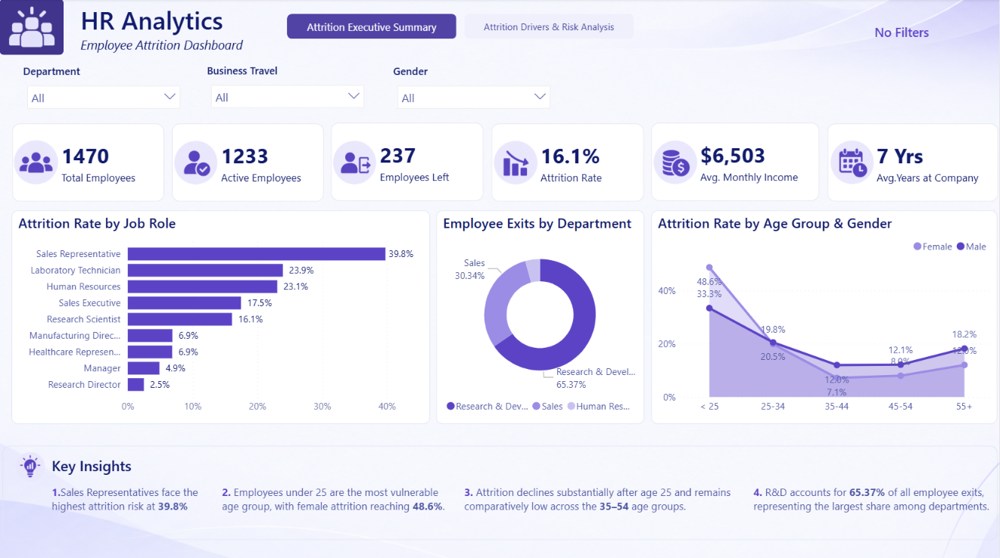
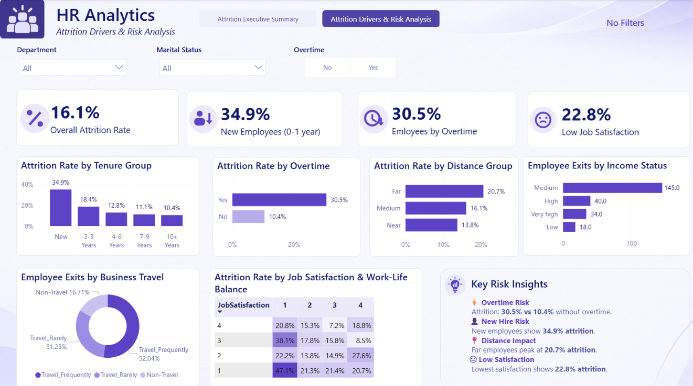

# HR Attrition Analysis | Power BI

## 📌 Project Overview

This project analyzes employee attrition using the HR Employee Attrition dataset to identify workforce patterns and factors associated with employee turnover.

The analysis focuses on key HR metrics and explores attrition across employee demographics (age, gender, and marital status), job roles, tenure, overtime, business travel, job satisfaction, income groups, and distance from home. The findings are presented through a two-page interactive Power BI dashboard designed to provide both a high-level workforce overview and a deeper analysis of attrition drivers.

## 🎯 Project Objectives

- Measure the overall employee attrition rate and key workforce KPIs.
- Identify employee groups with higher attrition levels.
- Analyze attrition patterns across job roles, demographics, tenure, overtime, business travel, job satisfaction, income status, and distance from home.
- Highlight key workforce patterns that can support data-driven HR decision-making.

## 🗂️ Dataset & Data Preparation

The project uses the HR Employee Attrition dataset, containing employee-level information related to demographics, job characteristics, work experience, and attrition.

Before building the dashboard, the dataset was prepared for analysis by:

- Removing fields that were not relevant to the analysis.
- Creating **Age Group** to analyze attrition across different age segments.
- Creating **Tenure Group** to examine attrition by years spent at the company.
- Creating **Distance Group** to analyze employee attrition based on distance from home.
- Creating **Income Status** to compare attrition across income segments.

- ## 🛠️ Tools & Technologies

- **Power BI** — data transformation, analysis, data modeling, and dashboard development
- **Power Query** — data preparation and transformation
- **DAX** — calculated measures and analytical KPIs

## 📐 DAX Measures & KPIs

Custom DAX measures were created to support workforce and attrition analysis, including:

- **Total Employees** — total number of employees in the dataset
- **Active Employees** — number of employees who did not leave the company
- **Attrition Count** — number of employees who left the company
- **Attrition Rate** — percentage of employees who left the company
- **Average Age** — average employee age
- **Average Monthly Income** — average monthly income across employees
- **Average Years at Company** — average employee tenure at the company

## 📊 Dashboard

The Power BI dashboard consists of two analytical pages:

### 1. Attrition Executive Summary

Provides a high-level overview of the workforce and key attrition metrics, along with attrition patterns across major employee segments.



### 2. Attrition Drivers & Risk Analysis

Provides a deeper analysis of the factors associated with employee attrition, helping identify workforce segments with higher attrition levels.



## 💡 Key Insights

- **Overall attrition stands at 16.1%**, with 237 employees leaving out of a workforce of 1,470.
- **Sales Representatives show the highest attrition rate at 39.8%**, substantially higher than other job roles.
- **Employees under 25 represent the most vulnerable age group**, with attrition reaching 48.6% among female employees and 33.3% among male employees.
- **New employees face significantly higher attrition**, with employees in their first year showing a 34.9% attrition rate; this rate declines as tenure increases.
- **Overtime is strongly associated with attrition:** employees working overtime have a 30.5% attrition rate compared with 10.4% among employees who do not.
- **Distance from home shows a clear pattern:** attrition increases from 13.8% for employees living near work to 20.7% for those living farther away.

## 🎯 Recommendations

Based on the observed attrition patterns, HR teams could consider:

- **Strengthening early-tenure retention initiatives**, with particular attention to employees in their first year.
- **Reviewing overtime practices and workload distribution**, especially among employee groups with elevated attrition rates.
- **Prioritizing retention analysis for Sales Representatives**, who show the highest attrition rate among job roles.
- **Further investigating the experience of younger employees**, particularly those under 25, to better understand the factors behind their higher attrition rates.
- **Considering commuting distance in workforce planning and retention strategies**, as employees living farther from work show higher attrition.

## 📁 Repository Structure

```text
HR-Attrition-Analysis/
│
├── dashboard/
│   └── HR-Attrition-Analysis.pbix
│
├── data/
│   └── HR-Attrition-Dataset.csv
│
├── images/
│   ├── 01-Executive-Summary.png
│   └── 02-Attrition-Drivers-Risk-Analysis.png
│
└── README.md
```

## 📚 Dataset Source

This project uses the **HR Employee Attrition** dataset to analyze workforce characteristics and employee attrition patterns.

**Source:** [HR Employee Attrition – Kaggle](https://www.kaggle.com/datasets/saurabhbadole/hr-employee-attrition)

The dataset is used for educational and portfolio purposes.
